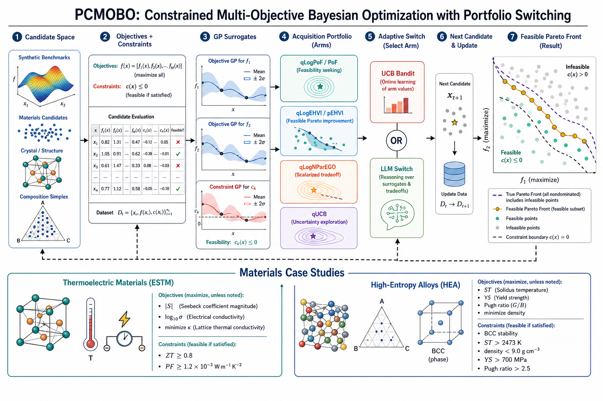
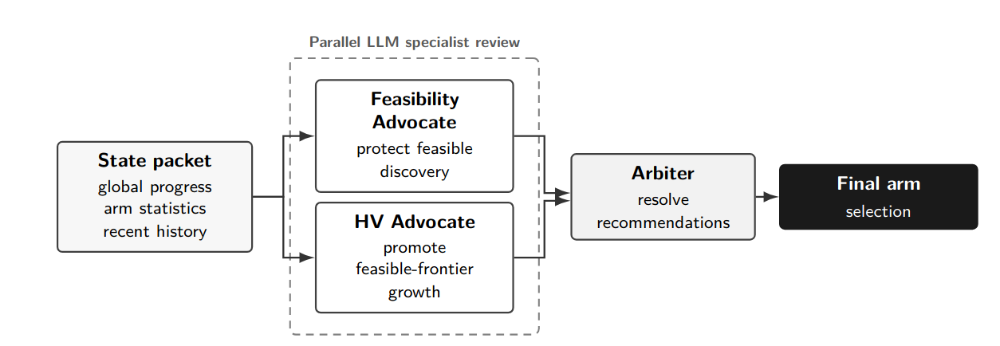

# PCMOBO

PCMOBO is a Python package for constrained multi-objective Bayesian optimization
with portfolio-based acquisition switching. It includes synthetic benchmark
campaigns and two materials-design case-studies: thermoelectric materials and
high-entropy alloys.




## Installation

From the repository root:

```bash
python3 -m venv .venv
./.venv/bin/python -m pip install --upgrade pip
./.venv/bin/python -m pip install -e ".[dev]"
```

The dependencies are declared in `pyproject.toml`.

Check the command-line entrypoints:

```bash
./.venv/bin/pcmbo-synthetic --help
./.venv/bin/pcmbo-hea --help
./.venv/bin/pcmbo-estm --help
```

## Quick Smoke Runs

Each campaign writes:

- `campaign_<seed>.csv`
- `run_config.json`

Synthetic constrained benchmark:

```bash
./.venv/bin/pcmbo-synthetic \
  --benchmark constrained_branin_currin \
  --policy qlogpof \
  --seeds 1 \
  --iterations 1 \
  --n-init 8 \
  --workers 1 \
  --results-dir runs/synthetic/smoke \
  --device cpu \
  --acq-mc-samples 16 \
  --acq-raw-samples 16 \
  --acq-num-restarts 1
```

High-entropy alloy design:

```bash
./.venv/bin/pcmbo-hea \
  --policy pof \
  --seeds 1 \
  --iterations 1 \
  --n-init 2 \
  --workers 1 \
  --results-dir runs/hea_design/smoke \
  --device cpu \
  --acq-mc-samples 16 \
  --acq-raw-samples 16 \
  --acq-num-restarts 1 \
  --acq-batch-eval-size 128
```

Thermoelectric materials design:

```bash
./.venv/bin/pcmbo-estm \
  --policy qlogpof \
  --seeds 1 \
  --iterations 1 \
  --n-init 3 \
  --workers 1 \
  --results-dir runs/estm_thermoelectric/smoke \
  --device cpu \
  --acq-mc-samples 16 \
  --acq-raw-samples 16 \
  --acq-num-restarts 1 \
  --acq-batch-eval-size 128
```

Increase `--iterations`, acquisition sampling settings, and seed sets for full
campaigns.

## Campaigns

### Synthetic Benchmarks

Available benchmark names:

- `constrained_branin_currin`
- `constr`
- `c2dtlz2_2obj`
- `c2dtlz2_3obj`
- `disc_brake`

### Thermoelectric Materials

The ESTM workflow is a finite-pool constrained-MOBO problem over a processed
mid-temperature thermoelectric materials dataset. The bundled pool contains
3,138 formula-temperature candidates and 856 unique formulas in the 300-600 K
temperature range.

The optimizer maximizes absolute Seebeck coefficient and electrical
conductivity while minimizing thermal conductivity. Feasibility is defined by:

- `ZT >= 0.8`
- `PF >= 1.2e-3`

### High-Entropy Alloys

The HEA workflow is a finite-pool constrained-MOBO problem for the
Nb-Mo-Ta-V-W-Cr alloy system. The bundled design space contains 40,553
candidate alloys.

The optimizer maximizes solidus temperature, yield strength, and Pugh ratio
while minimizing density. Feasibility combines objective-based constraints with
a BCC phase-stability screen:

- `ST > 2473 K`
- `density < 9.0 g cm^-3`
- `YS > 700 MPa`
- `Pugh ratio > 2.5`

## Policies

For synthetic and thermoelectric campaigns, fixed policies are:

- `qlogpof`
- `qlogehvi`
- `qlognparego`
- `qucb`

For HEA campaigns, fixed policies are:

- `pof`
- `pehvi`
- `qlognparego`
- `qucb`

Adaptive policies are:

- `bandit_ucb_switch`
- `llm_switch`

## LLM Policy



Fixed policies and `bandit_ucb_switch` do not require an API key. The
`llm_switch` policy requires an OpenAI API key.

Create a local `.env` file from `.env.example`:

```bash
cp .env.example .env
```

Then set:

```bash
OPENAI_API_KEY="your_openai_key_here"
```

Keep `.env` private and untracked.

## Output Paths

Use `--results-dir` to choose an explicit output directory. By default,
generated runs are rooted under `runs/` in the current working directory. Set
`PCMBO_OUTPUT_ROOT` to choose a different default root:

```bash
export PCMBO_OUTPUT_ROOT=/path/to/pcmbo-runs
```

## Checks

```bash
./.venv/bin/python -m compileall -q src
./.venv/bin/python -m ruff check src
./.venv/bin/python -m ruff format --check src
```


Temporary BibTeX placeholder:

```bibtex
@misc{pcmbo2026,
  title = {Portfolio-Based Constrained Multi-Objective Bayesian Optimization for Materials Design},
  author = {Sinha, Sushant and Hardcastle, Christofer and Robinson, Robert and Padhy, Shakti Prasad and Vela, Brent and Allaire, Douglas and Arroyave, Raymundo},
  year = {2026},
  note = {Citation to be updated after arXiv release}
}
```
